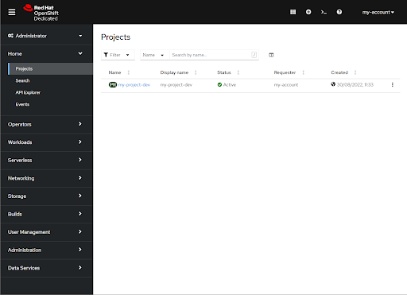
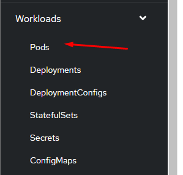
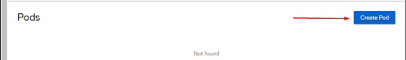
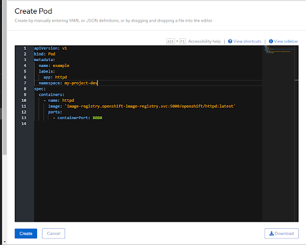
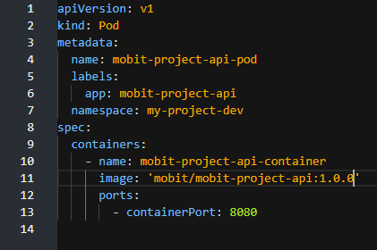
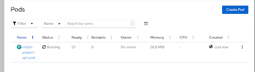
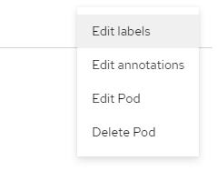
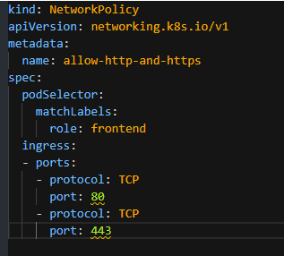
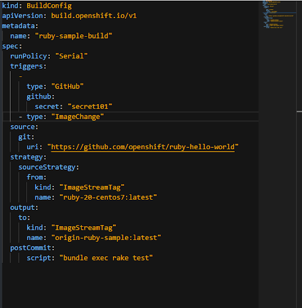
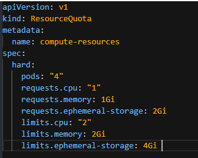

# Kubernetes (k8s) e Red Hat OpenShift Container Platform (OCP) #

## Índice ##

- [ Introdução ](#introducao)
- [ Pods ](#pods)
- [ Services ](#services)
- [ Config Maps ](#configmaps)
- [ Secrets ](#secrets)
- [ ReplicaSets ](#replicasets)
- [ Deployments ](#deployments)
- [ Volumes ](#volumes)
- [ Persistent Volume ](#persistentvolume)
- [ Persistent Volume Claims ](#persistentvolumeclaims)
- [ Storage Classes ](#storageclasses)
- [ Iniciando no OpenShift ](#iniciandonoopenShift)
- [ Replica set e Replication controller ](#replicasetereplicationcontroller)
- [ Deployment e DeploymentConfig ](#deploymentedeploymentconfig)
- [ Routes ](#routes)
- [ Network Policies ](#networkpolicies)
- [ Build e BuildConfigs ](#buildebuildconfigs)
- [ ImageStreams ](#imagestreams)
- [ Resource Quotas ](#resourcequotas)
- [ Operators ](#operators)

### Introdução ###

O Kubernetes, ou simplesmente k8s, é um projeto open source de Orquestração de Containers criado pela Google. Anunciado em 2014 e em 2015 doado para Cloud Native Computing Foundation, que é um braço da Linux Foundation.

A ideia do Kubernetes é trazer mais poder à gerência do cluster, criando diversos facilitadores, como por exemplo, Load Balancers.

### Pods ###

O Pod é a menor unidade quando se fala em Kubernetes. Na maioria dos casos tem somente um container em sua composição, mas é possível ter mais do que um. Resumindo, no kubernetes quando queremos criar containers, criamos na verdade pods, e declaramos os containers dentro dos pods.

Existe a possibilidade de gerenciarmos os pods de maneira imperativa e declarativa.

No mundo do Kubernetes, a depender da funcionalidade que iremos utilizar, precisamos especificar qual a versão da api pretendemos utilizar. Está tudo documento no link: https://kubernetes.io/docs/concepts/overview/kubernetes-api/.

Referência: https://kubernetes.io/docs/concepts/workloads/pods/

### Services ###

Os Services possibilitam a utilização de um ip fixo dentro da nossa rede de kubernetes, dns para um pod ou até para um conjunto de pods. Essa ideia de conjunto de pods, inclusive já é a porta de entrada para os Load Balancers.

Os tipos de Services são:

    ClusterIP: tem como objetivo facilitar a comunicação interna entre os pods com um ip fixo.
    NodePort: tem como objetivo expôr a porta de um nó do cluster utilizando NAT entre o ip porta do nó com um conjunto de ClusterIP.
    LoadBalancer: tem como objetivo expôr uma porta com IP fixo para o mundo externo englobando um conjunto de NodePort e também criando um balanceador de cargas.

Referência: https://kubernetes.io/pt-br/docs/tutorials/kubernetes-basics/expose/expose-intro/

### Config Maps ###

O Config Map é um objeto que visa o armazenamento de dados não confidenciais como variáveis de ambiente.
Como o ConfigMap não possui encriptação, quando se trata de dados que não podem estar expostos, o ideal é utilizar Secrets.
A maneira de utilizar ConfigMaps pode ser como argumento de linha de comando ou o referenciando na declaração do componente.

Referência: https://kubernetes.io/pt-br/docs/concepts/configuration/configmap/

### Secrets ###

Os Secrets já são mais indicados para situações onde o objetivo é guardar dados confidenciais como senha de banco, tokens ou chaves. A vantagem está em não precisar incluir esses dados dentro do código e sim só referenciá-los como uma variável de ambiente.

Referência: https://kubernetes.io/pt-br/docs/concepts/configuration/secret/

### ReplicaSets ###

Os pods são efêmeros e quando os criamos, não temos garantia de que ele esteja sempre disponível. Caso um pod nosso de nginx cair por algum motivo, ele não voltará mais. Conseguimos resolver esse problema com os ReplicaSets, trazendo proatividade ao nosso cluster. Dentro do nosso RS, podemos ter um ou mais pods. Inclusive configurar um número mínimo, um número máximo e um número desejado de pods.
Apesar de já parecer uma boa solução para o problema, a própria documentação de Kubernetes indica a utilização de Deployments.

Referência: https://kubernetes.io/docs/concepts/workloads/controllers/replicaset/

### Deployments ###

Os Deployments são nada mais nada menos do que uma camada acima de um ReplicaSet. Nos traz diversas outras features interessantes, como por exemplo, um histórico do que acontece com os nossos pods. Caso alteremos a versão da imagem que o pod está utilizando, irá gerar uma revisão, como um commit ou uma tag em um repositório git. Isso nos dá a possibilidade de voltar para determinada versão.

Referência: https://kubernetes.io/docs/concepts/workloads/controllers/deployment/

### Volumes ###

Assim como em containers docker, os nossos pods são efêmeros e ao deletarmos o pod, ou até mesmo ele cair por algum motivo, perderíamos os dados. Podemos utilizar Volumes para resolver esse problema. Outra situação também resolvida é de quando existem arquivos compartilhados entre containers dentro de um mesmo pod.

Um ponto importante sobre os Volumes são os tipos. O mais trivial é o hostPath, que nos possibilita linkar um arquivo ou um diretório da máquina host com um arquivo ou diretório dentro do pod. Já o awsElasticBlockStore nos permite criar um volume entre o nosso pod e um EBS no AWS.

Referência: https://kubernetes.io/docs/concepts/storage/volumes/

### Persistent Volume ###

A ideia de Persistent Volumes é separar o gerenciamento de armazenamento do gerenciamento dos nossos pods.
Possui um ciclo de vida independente dos pods, ou seja, é possível criar o PV mesmo sem criar um pod.

Existem duas maneiras de provisionar PVs, de maneira estática e de maneira dinâmica.
A maneira estática se dá por um arquivo de definição especificando exatamente o PV que deve ser criado. Já a dinâmica se dá por StorageClasses.

Após o PV criado, a maneira que utilizamos para conseguir utilizar esse PV em determinado pod é utilizando Persistent Volume Claims.

Referência: https://kubernetes.io/docs/concepts/storage/persistent-volumes/

### Persistent Volume Claims ###

A maneira de fazer o binding de um PV com um Pod é utilizando Persistent Volume Claims. Com o PVC, conseguimos requisitar os recursos que o PV disponibiliza. É possível, por exemplo, solicitar somente leitura a um determinado PV, ou que somente um pod por vez possa acessar esse PV.

Referência: https://kubernetes.io/docs/concepts/storage/persistent-volumes/

### Storage Classes ###

Com StorageClass conseguimos provisionar dinamicamente um disco em um Cloud Provider.

Referência: https://kubernetes.io/docs/concepts/storage/storage-classes/

---

### Iniciando no OpenShift ###

“O [Red Hat OpenShift](https://www.redhat.com/pt-br/technologies/cloud-computing/openshift) é uma plataforma de aplicações em containers Kubernetes pronta para empresas…”

Se chegamos até aqui, já temos uma boa base de virtualização, containers e Kubernetes. É facilmente perceptível a facilidade que o Kubernetes nos dá na gerência do nosso cluster, mas também a complexidade do mesmo, e ainda pior caso precisemos gerenciar vários clusters. Diversos arquivos e arquivos extensos. Pods, Services, ReplicaSets, Deployments, ConfigMaps, Secrets… O OpenShift nos trás justamente uma facilidade na gerência do nosso cluster Kubernetes criando uma interface gráfica e entregando ainda mais features que o vanilla Kubernetes não nos entrega. Ainda melhor, facilita a gerência de clusters Kubernetes.

Documentação: https://docs.openshift.com/container-platform/4.11/welcome/index.html

Essa é a nossa primeira impressão sobre o OpenShift

A primeira observação que podemos fazer é que basicamente a configuração começa com um Project. Dessa maneira conseguimos gerenciar os recursos do cluster e separar responsabilidades por usuário ou grupos de usuários, seja desenvolvedor ou administradores do OpenShift.

_Esse ambiente da imagem é um ambiente de sandbox que a Red Hat fornece por 30 dias apenas para testes._

Nesse menu lateral temos acesso as features da ferramenta.

Em Workloads encontramos alguns nomes familiares como Pods.

Entrando no menu de Pods, nos deparamos com essa interface e com o botão **Create Pod**

Clicando em Create Pod, a ferramenta nos disponibiliza um editor de texto com um template pré-configurado de um pod com um container de apache server de exemplo.

Devemos editar essa declaração de pod com o conteúdo do nosso pod. Por exemplo, caso queiramos criar um pod a partir de uma imagem de alguma api nossa hospedada no DockerHub:

Clicando em Create, a listagem que antes não tinha nada, agora tem o nosso pod.

Interessante essa listagem. Conseguimos ver o nome do pod, o seu status e mais outras informações.

No menu do lado direito é possível editar o nosso Pod ou até mesmo deletá-lo.

Referência:
https://docs.openshift.com/container-platform/4.11/welcome/index.html

### Replica set e Replication controller ###

Replication Controller seria uma versão anterior a Replica set, ambos resolvem o mesmo problema de replicar pods e garantir a quantidade de réplicas desejadas a depender do cenário. Existem apenas algumas diferenças no arquivo de definição, mas o funcionamento é o mesmo.

Se analisarmos o exemplo proposto pelo próprio OpenShift, podemos perceber que a diferença da declaração é apenas em cima do selector.

Referência: https://docs.openshift.com/container-platform/3.11/architecture/core_concepts/deployments.html

### Deployment e DeploymentConfig ###

Assim como ReplicaSet e RepplicationController, Deployment e DeploymentConfig tem a mesma função. Ambos criam ReplicaSet para gerenciar a quantidade de réplicas dos pods com o histórico do que acontece no ambiente. A diferença é que DeploymentConfig trás um adicional que são triggers. Por exemplo, atualizar a versão do Deployment com base em uma nova versão da imagem do container utilizado.

Nesse caso, no arquivo de definição a história se repete quando se fala em selectors.

Referência: https://docs.openshift.com/container-platform/3.11/architecture/core_concepts/deployments.html

### Routes ###

Routes são um caminho para expôr externamente um service fornecendo um hostname acessível. É importante salientar que qualquer acesso de fora do OCP só é possível a partir de um route.

Referência: https://docs.openshift.com/container-platform/3.11/architecture/networking/routes.html

### Network Policies ###

Um cluster complexo vai trazer uma série de pods que talvez não fosse interessante que pudessem se comunicar. Acontece que por padrão, todos os pods conseguem se comunicar entre si dentro de um projeto por meio de seus endpoints. Caso haja a necessidade de limitar o acesso a determinado pod, é só criar uma Network Policy e como tudo no K8s é só utilizar selectors.

Exemplo:

Desse modo, limitamos o acesso aos pods declarados com o label role=frontend a somente conexões TCP nas portas 80 e 443.

Referência: https://docs.openshift.com/container-platform/4.11/networking/network_policy/about-network-policy.html#about-network-policy

### Build e BuildConfigs ###

O Build é o processo de criação de uma imagem e o BuildConfig é a definição de como esse build deve acontecer.

Por exemplo:

Esse BuildConfig define que deve acontecer um Build sempre que houver alguma alteração no repositório ou quando houver alguma mudança na imagem. E o resultado desse Build irá criar uma tag no ImageStream.

Referência: https://docs.openshift.com/container-platform/4.7/cicd/builds/understanding-buildconfigs.html

### ImageStreams ###

ImageStreams nada mais são do que referências a imagens, seja no registry interno do OCP ou em repositórios externos.

No caso do exemplo acima, a imagem gerada a partir do build em questão irá gerar uma tag origin-ruby-smaple:latest no ImageStream. Não é gerada uma imagem e sim somente uma referência a uma imagem. Isso é útil quando determinada tag está sendo utilizada em diversos lugares e há uma mudança na imagem. Sem ImageStreams, seria necessário alterar a versão da imagem onde a mesma estivesse sendo utilizada.

Referência: https://docs.openshift.com/container-platform/4.7/rest_api/image_apis/imagestream-image-openshift-io-v1.html

### Resource Quotas ###

Resource Quotas são limitações que podemos criar por project no nosso cluster. Digamos que temos 3 projects e precisamos que o primeiro não exceda  20% do consumo de cpu. Podemos fazer essa limitação utilizando Resource Quotas. Não só recurso computacional como também a quantidade de réplicas que podemos criar ou a quantidade de pods e etc.

Por exemplo:

- O limite de pods a serem criados é 4
- Cada container terá disponível sempre que precisar 1 core, 1 giga de ram e 2 gigas de storage.
- E por fim, cada container poderá no máximo consumir 2 cores, 2 gigas de ram e 4 gigas de storage.

Referência: https://docs.openshift.com/container-platform/4.7/applications/quotas/quotas-setting-per-project.html

### Operators ###

Operators são parecidos com plugins. Criados pela própria RedHat, por provedores de software ou até mesmo pela comunidade.

Eles podem ser encontrados no [OperatorHub.io.](https://operatorhub.io)

A RedHat define Operators como pedaços de software que facilitam a complexidade operacional de executar outros softwares. Podemos analisar o [Elasticsearch (ECK) Operator](https://operatorhub.io/operator/elastic-cloud-eck) que facilita o deployment, provisionamento, gerenciamento e orquestração de vários softwares da [ELK](https://www.elastic.co/pt/what-is/elk-stack).

---

Fato curioso ( NERD ALERT ) !!!

O nome Kubernetes deriva de uma palavra grega para Timoneiro, o responsável por conduzir um navio. Eis o motivo da logo ser um timão. Esse timão tem 7 lados como uma referência a personagem Sete da Série Star Trek. A mesma era uma Borg, e Borg ou Google Borg é um gerenciador de cluster onde muitos dos principais contribuintes do k8s trabalharam.